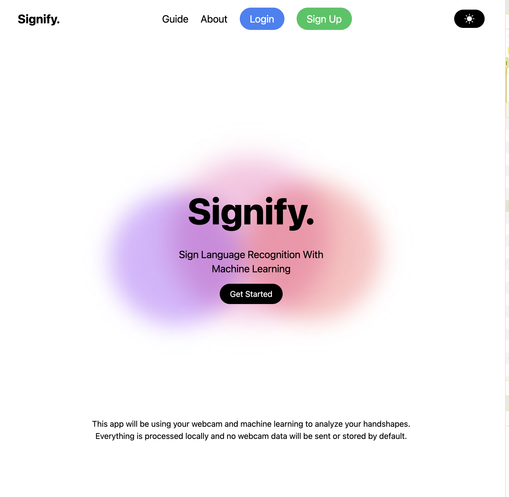

# 🌟 Signify Application

> ⚠ **Important Note**:
>
> - The **backend implementation** is **not completed** and currently lacks certain features for production readiness.
> - The **object detection model** needs **further training** to improve accuracy and performance.

Welcome to Signify, a web application for user authentication and real-time object detection using modern frameworks like React, TypeScript, FastAPI, and TensorFlow.js. This document provides an overview of the application, its features, and setup instructions. 🚀

---

## 📝 Overview

The solution is designed to achieve the following:

- Enable secure user authentication (signup, login, and logout).
- Perform real-time object detection using a webcam and TensorFlow.js.

---

## 🛠 Solution Overview

The solution comprises three key layers:

### 1. **Frontend**

- **Framework**: Built with **React** and **TypeScript**.
- **UI Features**:
  - User-friendly modals for authentication (login and signup).
  - Real-time object detection using a webcam interface.
  - Responsive design for a seamless user experience across devices.

### 2. **Backend**

- **Framework**: Developed with **FastAPI**.
- **Endpoints**:
  - `/auth/signup`: Handles user signup.
  - `/auth/login`: Authenticates users and provides access and refresh tokens.
  - `/auth/logout`: Logs out users by clearing cookies.
  - `/auth/refresh`: Refreshes access tokens for authenticated users.

### 3. **Object Detection**

- **Technology**: Uses **TensorFlow.js** for real-time object detection.
- **Features**:
  - Detects objects using a pre-trained TensorFlow.js model.
  - Displays detected objects and their confidence scores on a live video feed.

---

## 🚀 Getting Started

Follow these steps to set up and run the project locally:

### 1. Install Dependencies

Install the dependencies for both the client and server:

```bash
npm run install:all
```

### 2. Start the Application

Run both the client and server simultaneously:

```bash
npm run start:all
```

### 3. Access the Application

- Frontend: Open your browser and navigate to [http://localhost:3000](http://localhost:3000).
- Backend: The API runs at [http://localhost:8000](http://localhost:8000).

---

## 🛠 Features

### 1. **Authentication**

- Secure user signup and login functionalities.
- Token-based authentication using access and refresh tokens.
- Logout functionality to clear user sessions.

### 2. **Object Detection**

- Real-time object detection using TensorFlow.js.
- Displays detected objects with their confidence scores.
- Responsive design for webcam and detection overlay.

### 3. **Tech Stack**

- **Frontend**: React, TypeScript, TailwindCSS.
- **Backend**: FastAPI, PostgreSQL (database).
- **AI**: TensorFlow.js for object detection.

---

## Screenshots

### 1. Home Page



---

## 🔧 Future Enhancements

- **Training model**: Train the model further to improve object detection accuracy.
- **Backend Completion**: Finish and enhance backend features for deployment.
- **Dashboard for Authenticated Users**: Create a personalized dashboard with user activity logs.
- **Advanced Error Handling**: Add fallback UIs and error boundaries.
- **Comprehensive Testing**: Introduce unit and integration tests for backend and frontend.
- **Skeleton Loading**: Improve UX with skeleton loaders during API calls.
- **Database Optimization**: Refine database queries for performance.

---

## 📝 Notes

If you encounter any issues or have suggestions for improvement, feel free to reach out!

---

## 📬 Contact Me

💼 [LinkedIn](https://www.linkedin.com/in/yaroslav-matushevych)  
📧 yaroslav.matushevych@gmail.com

---

### 🙌 Thank You!

Thank you for exploring Signify! Your feedback is highly appreciated. 😊
